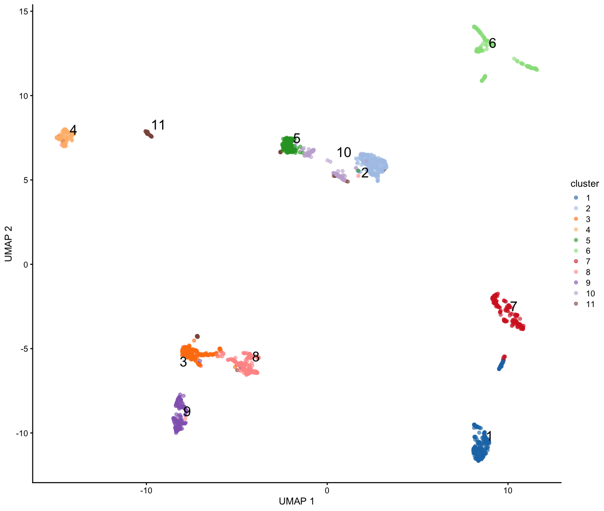
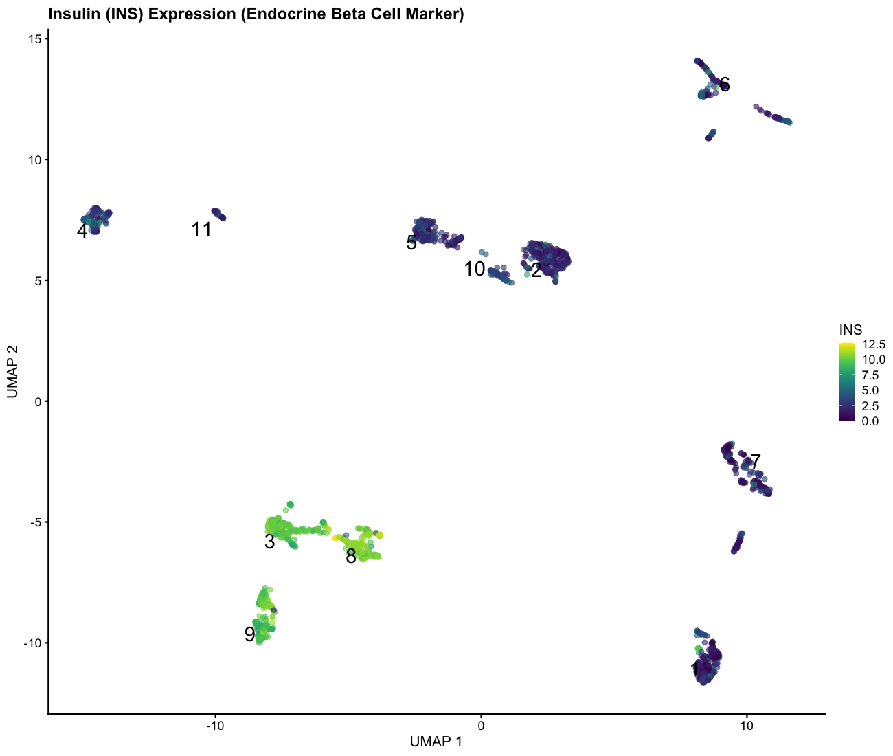
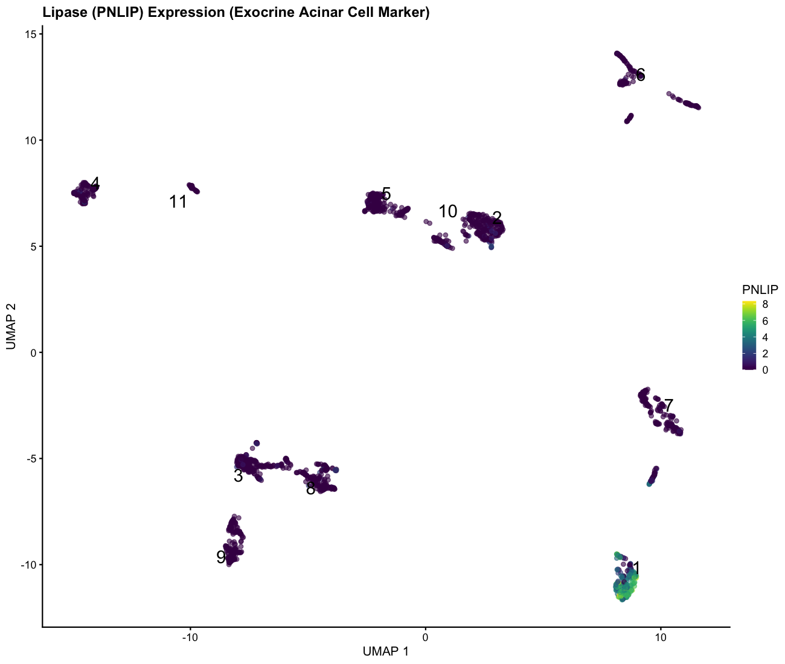
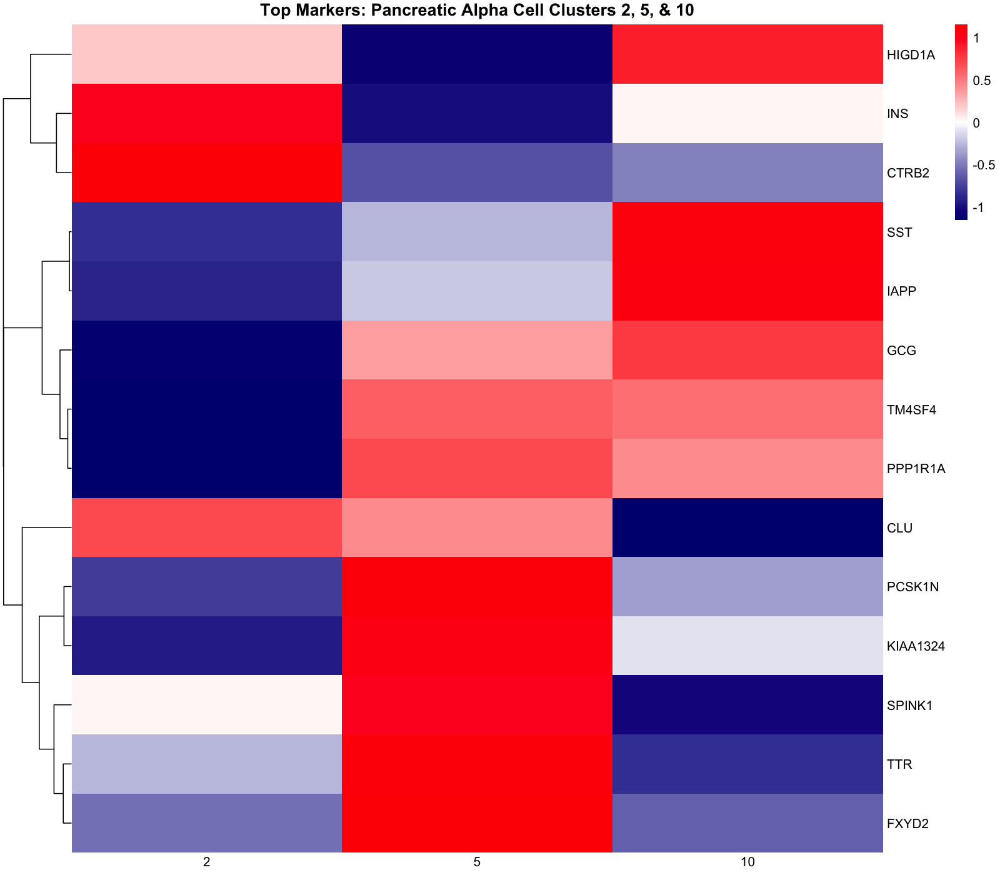
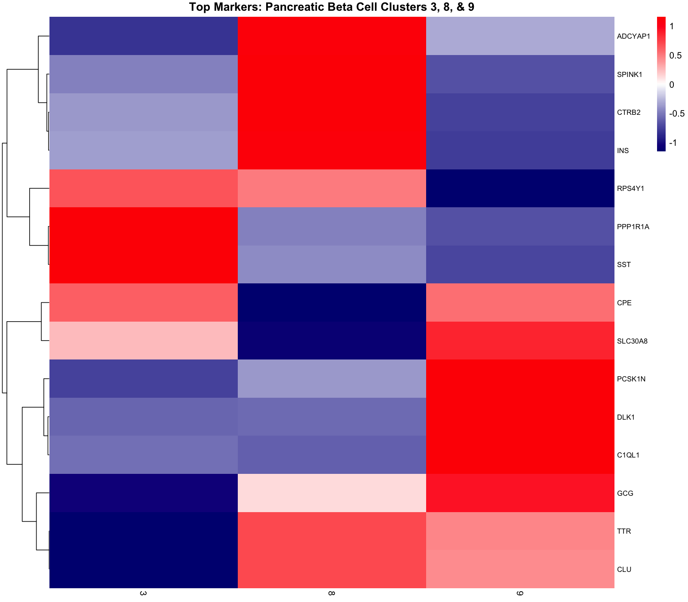

# Single Cell RNA-Seq Pancreas Project

## Introduction/Project Summary
This project analyzes ~2000 human pancreatic cells from the Baron single-cell dataset using scater, scran, and UMAP clustering.
After performing the QC, normalization, HVG selection, PCA analysis, and clustering steps, I identified endocrine and exocrine cell groups (alpha, beta, and acinar). I specifically mapped insulin (INS), glucagon (GCG), and lipase (PNLIP) expression to clusters representing these cell types.
Louvain clustering revealed multiple healthy/normal and transitional endocrine cell states, as well as clusters with possible disease signatures (ex: cancer, diabetes, hypoglycemia, insulin resistance).
I compared top marker genes across alpha clusters (2, 5, 10) and beta clusters (3, 8, 9), and generating heatmaps to interpret cell-state differences, including healthy, transitional, and potentially diabetic/cancer-like profiles.
RNA-Seq is a useful tool to analyze the presence of markers in various cellular states. This becomes a key method in identifying certain markers that can appear in normal and healthy disease states. For example, in the pancreatic endocrine environment, an observed difference in insulin expression in different clusters can provide information on how it is expressed in normal vs disease states (insulin resistance, type I/II diabetes, and endocrine pancreatic cancer). The same can be performed in the pancreatic exocrine environment by comparing the difference in lipase expression between normal and disease states (example: exocrine pancreatic cancer or enzyme insufficiency).

## Install and Load the Required Package

```r
#Install necessary packages
BiocManager::install(c("ExperimentHub", "scater", "scran", " scRNAseq", "AnnotationHub", "ensembldb"))
install.packages(c("ggplot2", "igraph", "pheatmap"))
 	
#Load necessary packages
library(ExperimentHub)
library(scater)
library(scran)
library(scRNAseq)
library(ggplot2)
library(igraph)
library(pheatmap)
library(AnnotationHub)
library(ensembldb)
```

## Accessing the pancreatic dataset
The Baron Pancreas Database will be used as the cell source of the single cell RNA-Seq analysis. Run the following codes to access it

```r
#Access Experiment Hub
eh <- ExperimentHub()
# Load the data. Here the Baron Pancreas Database, a large dataset of human and mouse pancreatic tissue single-cell RNA-sequencing data, will be used.
# This will automatically download the data from ExperimentHub
sce <- BaronPancreasData('human') 
#Note that this database contains many cells! Loading and analyzing the entire number of cells will be very time consuming. To simplify the process, subset a small sample of cells ~2000.
```

## Subset to ~2000 cells.
The Baron database is large. As a result, I am interested in subletting 2000 cells for analysis.
To subset, a seed can be selected. A seed is set purely for statistical reproducibility. Each seed you set will generate the same randomly selected sequence of cells for the analysis, with each seed number representing a different sequence of cells. In theory, you can set any number as your seed, though 123 will be selected as it a very commonly selected seed in statistics tutorials. If one were to repeat this project and they also set their seed to 123, they should have identical statistical results.

```r
set.seed(123)
sce <- sce[, sample(ncol(sce), min(2000, ncol(sce)))]
```

## Quality Control Step
The next important step is quality control. The purpose of single-cell RNA-Seq analysis is to remove “noise” and cellular data with low counts or poor-quality results. Performing this QC steps allows for analysis optimization. There are many different QC test to perform on cell datasets, such as removing cell data containing large mitochondria as this indicates cell death and damage. However, I want to keep it simple and filter for low cell counts.

```r
#This step will add the new calculated QC metrics for each cell and add them as extra columns in the metadata table of the SingleCellExperiment object.
sce <- addPerCellQC(sce)
#Threshold setting – remove cells with less than 1000 transcripts and less than 500 genes
sce <- sce[, sce$sum > 1000 & sce$detected > 500]
#Identify how many cells and genes currently present in the dataset after QC
dim(sce)
```
Output
```text
[1] 20125  2000
```

After running the QC step, I still have 2000 cells. This means that the cells at seed 123 have already met the selected threshold and illustrates the high-quality randomly selected cell data.

## Data normalization
The next step is to normalize the data. Single cell RNA-Seq data is messy. It is necessary to transform the data into an even distribution PCA and statistical analysis. To normalize single cell data, use scran.

```r
#Normalize the data via scran.
set.seed(123) #same seed used for filtering
#Pre-clustering
clusters <- quickCluster(sce)
#Compute size factor (different cells in the data will have more reads)
sce <- computeSumFactors(sce, clusters=clusters)
#Apply log form to make data more evenly distributed (also required for PCA transform step)
sce <- logNormCounts(sce)
```
## Identifying high variance genes
Next, the find high variance genes must be identified. These genes will be specific to certain clusters that will be produced in the UMAP plot, which correspond to specific cell states. On the other hand, I want to remove low variance genes as they have little to no specificity and will appear in most or all clusters. Examples of high variance pancreatic genes are INS, GCG, and PNLIP, while low variance pancreatic genes include ACTB and GAPDH.

```r
#Model the variance
dec <- modelGeneVar(sce)
#Select the top 10% genes with the highest biological variance.
hvg <- getTopHVGs(dec, prop=0.1)
```

## Perform principal component analysis (PCA)
PCA takes all the genetic data and turns it into an interpretable lower dimension space. Then UMAP transforms the structure into 2D for visualization)

```r
#Convert gene expression into components
sce <- runPCA(sce, subset_row=hvg)
sce <- runUMAP(sce, dimred="PCA")
```

## Cluster the data
Clustering visually groups cells based on how similar their genetic profiles are. Here, I perform “Shared Nearest Neighbor (SNN)” function at k = 15 (the sweet spot of forming clusters. Anything lower will create too many distinct clusters, anything larger will form large unrelated clusters)

```r
g <- buildSNNGraph(sce, k = 15) 
#Perform clustering. There are multiple methods (ex: Leidej, k-means, and, Louvain, and Walktrap). The Louvain method will be used
sce$cluster <- factor(igraph::cluster_louvain(g)$membership)
```

Now that all the data is ready, the next step is to plot the UMAP where each cluster represents a cell state

```r
#Plot the UMAP (color-coded and numbered)
plotUMAP(sce, colour_by="cluster", text_by="cluster")
```



This UMAP has 11 distinct clusters

##Visualizing Markers in the UMAP
Next I want to find clusters where are 3 genes of interest are present in the dataset.

```r
#Confirm that insulin (INS), glucagon (GCG), and lipase (PNLIP) exist in the dataset
"INS" %in% rownames(sce)
```
Output
```text
[1] TRUE
```
```r
"GCG" %in% rownames(sce)
```
Output
```text
[1] TRUE
```
```r
"PNLIP" %in% rownames(sce)
```
Output
```text
[1] TRUE
```

Next, extract the normalized expression level for the 3 genes of interest for every cell and store the data into a new column in the metadata table.

```r
# Add the specific gene expression columns
sce$INS <- as.numeric(logcounts(sce)["INS", ])
sce$GCG <- as.numeric(logcounts(sce)["GCG", ])
sce$PNLIP <- as.numeric(logcounts(sce)["PNLIP", ])
```

Below, I will run codes to generate the UMAP cluster plot that consist of various pancreatic cell types grouped into various clusters. This is done to identify which cell state each cluster represents (ex: acinar or beta or acinar/normal, diseased, or transitioning). To do so, the plot must be colored by each marker of interest (ex: insulin “INS”, glucagon “GCG”, and lipase “PNLIP”).
When either one of these is plotted, a UMAP that contains multiple clusters will be produced. These clusters represent groups of distinct pancreatic cell states in the dataset. When a marker is plotted, the cluster(s) possessing the marker will have a distinct color from the remaining clusters.

```r
#Visualize beta cells (insulin marker)
plotUMAP(sce, colour_by="INS", text_by="cluster") +
  ggtitle("Insulin (INS) Expression (Endocrine Beta Cell Marker)")
```



Interpretation: There is high insulin expression in clusters 3, 8, and 9 and very low expression in other clusters. Therefore, clusters 3, 8, and 9 are likely to correspond to various beta cell states (ex: healthy, diabetic, cancer).

```r
#Visualize alpha cells (glucagon marker)
plotUMAP(sce, colour_by="GCG", text_by="cluster") +
  ggtitle("Glucagon (GCG) Expression (Endocrine Alpha Cell Marker)")
```


Interpretation: There is high glucagon expression in clusters 2, 5, and 10 and very low expression in other clusters. Therefore, these clusters are likely to correspond to various alpha cell states (ex: healthy, hypoglycemia, cancer).

```r
#Visualize acinar cells (lipase marker)
plotUMAP(sce, colour_by="PNLIP", text_by="cluster") +
  ggtitle("Lipase (PNLIP) Expression (Exocrine Acinar Cell Marker)")
```



Interpretation: There is highly specific lipase expression in cluster 1 only and no detectable expression in other clusters. This single cluster therefore represents normal and healthy acinar cells.

## Generate a comparative heat map for the top 10 most significant genes in each beta and alpha clusters
Here, I will be performing a comparative statistical analysis of the top 10 expressed markers in each key beta clusters (3, 8, and 9) and alpha clusters (2, 5, and 10). A heatmap will be generated to visualize expression patterns.

```r
#Find markers specifically for all clusters
all_markers <- findMarkers(sce, groups=sce$cluster)
```
```r
#Generate heat map for alpha cell clusters 
#Target alpha clusters are 2, 5, and 10. 
target_clusters <- c("2", "5", "10")
#Get the top 10 marker genes per cluster using “all_markers” object.
top_genes <- unique(unlist(lapply(target_clusters, function(x) {
    head(rownames(all_markers[[x]]), 10)
})))
#Prepare matrix for pheatmap (group cells by cluster)
cluster_means <- aggregateAcrossCells(sce, ids=sce$cluster, statistics="mean")
#Subset the group matrix to only include top 10 genes from clusters 2, 5, and 10.
plot_matrix <- assay(cluster_means)[top_genes, target_clusters]
#Z-score scaling (transforms the data to reflect the marker abundance relative to just the 3 samples rather than the entire set of clusters)
mat_scaled <- t(scale(t(plot_matrix)))
#Plot
pheatmap(mat_scaled, main = "Top Markers: Pancreatic Alpha Cell Clusters 2, 5, & 10", cluster_rows = TRUE, cluster_cols = FALSE, angle_col = "0", color = colorRampPalette(c("navy", "white", "red"))(100), border_color = NA)
```



Interpretation: Here the expression profile of each cluster relative to the total 3 varies. These genes are observed to play a role in cell growth, stability, glucagon production, and insulin-glucagon homeostasis.  For example, HIGD1A promotes alpha cell survival and protection from apoptotic signals, SST and TTR promotes the release of glucagon, PPP1R1A is linked to Type 2 diabetes, and SPINK1 prevents the early activation of trypsin enzyme to avoid auto-digestion of pancreatic cells.
Each cluster expresses these protective and homeostatic genes at high levels, which supports that these are likely healthy and normal pancreatic alpha cell states. Conversely, there is a moderate expression level of PPP1R1A in Clusters 5 and 10 relative to Cluster 2 which might support a Type 2 diabetes connection. However, these clusters express supportive and homeostatic genes are high levels, which is conclusive if healthy and normal alpha cells
Finally, insulin has a higher expression level within Cluster 2, while Clusters 5 and 10 have higher glucagon levels. Because this expression is relative amongst the 3 populations, therefore Clusters 5 and 10 likely represent normal mature alpha cells and Cluster 2 represents normal alpha-beta (AB) transitional cells due to its low-level glucagon expression and high-level insulin expression.

```r
#Generate heat map for beta cell clusters 
#Target beta clusters are 3, 8, and 9. 
target_clusters <- c("3", "8", "9")
#Get the top 20 marker genes per cluster using “all_markers” object.
top_genes <- unique(unlist(lapply(target_clusters, function(x) {
    head(rownames(all_markers[[x]]), 10)
})))
#Prepare matrix for pheatmap (group cells by cluster)
cluster_means <- aggregateAcrossCells(sce, ids=sce$cluster, statistics="mean")
#Subset the group matrix to only include top 10 genes from clusters 3, 8, and 9.
plot_matrix <- assay(cluster_means)[top_genes, target_clusters]
#Z-score scaling (transforms the data to reflect the marker abundance relative to just the 3 samples rather than the entire set of clusters)
mat_scaled <- t(scale(t(plot_matrix)))
#Plot
pheatmap(mat_scaled, main = "Top Markers: Pancreatic Beta Cell Clusters 3, 8, & 9", cluster_rows = TRUE, cluster_cols = FALSE, angle_col = "0", color = colorRampPalette(c("navy", "white", "red"))(100), border_color = NA)
```



Interpretation: There are many of the same protective and homeostatic genes that were observed in the alpha cell heat map, which suggests these also play a role in insulin balance and production and beta cell survival. Some new genes are observed here, but not seen in the previous heat map, are ADCYAP1, which stimulates beta cells to produce insulin, SLC30A8 is strongly linked to Type II diabetes, DLK1 supports beta cell development and functions, and RPS4Y1 is a Y-linked gene linked to pancreatic cancer in men.
Clusters 8 and 9 heavily express different beta cell growth- and balance-promoting genes more than Cluster 3 does. This supports the idea that these 2 clusters represent healthy and normal beta cell states. Additionally, Type II diabetes markers PPP1R1A and SLC30A8 expression, with the former heavily expressed in Cluster 3 and the latter heavily expressed in Clusters 3 and 9. Therefore Cluster 3 likely represents a diseased pancreatic state, either cancer or type II diabetes. While Cluster 9 moderately expresses SLC30A8, it has an even higher expression level of supportive genes such as PCSK1N and DLK1, which supports this cluster represents a healthier beta cell state. Additionally, Cluster 8 heavily expresses ADCYAP1, SPINK1, CTRB2, INS, and has low expression levels of PPP1R1A and SLC30A8, which supports the conclusion that this cluster represents healthy and normal beta cells.
Finally, high INS expression is observed in Cluster 8 and low expression is observed in Cluster 3 and 9. There is also low GCG expression in Cluster 3 and moderate expression in Clusters 8 and 9. This may suggest that Cluster 9 may represent normal alpha-beta (AB) transitional cells.

## Bonus section: Determining the chromosome location, start and end positions, and strand direction of insulin, glucagon, and lipase using AnnotationHub and GRanges.
```r
#Access the hub
ah <- AnnotationHub()
#Pull the list of all Ensembl databases for humans
human_ens_dbs <- query(ah, c("EnsDb", "Homo sapiens"))
#Print the AH IDs and Ensembl version (select the latest)
as.data.frame(mcols(human_ens_dbs))[, c("title", "rdatadateadded")]
```

Output
```text
                                      title rdatadateadded
AH53211   Ensembl 87 EnsDb for Homo Sapiens     2017-02-07
AH53715   Ensembl 88 EnsDb for Homo Sapiens     2017-04-05
AH56681   Ensembl 89 EnsDb for Homo Sapiens     2017-06-29
AH57757   Ensembl 90 EnsDb for Homo Sapiens     2017-08-31
AH60773   Ensembl 91 EnsDb for Homo Sapiens     2017-12-21
AH60977   Ensembl 92 EnsDb for Homo Sapiens     2018-04-13
AH64446   Ensembl 93 EnsDb for Homo Sapiens     2018-08-20
AH64923   Ensembl 94 EnsDb for Homo sapiens     2018-10-11
AH67950   Ensembl 95 EnsDb for Homo sapiens     2019-01-14
AH69187   Ensembl 96 EnsDb for Homo sapiens     2019-04-15
AH73881   Ensembl 97 EnsDb for Homo sapiens     2019-05-02
AH73986   Ensembl 79 EnsDb for Homo sapiens     2019-05-02
AH75011   Ensembl 98 EnsDb for Homo sapiens     2019-05-02
AH78783   Ensembl 99 EnsDb for Homo sapiens     2019-10-29
AH79689  Ensembl 100 EnsDb for Homo sapiens     2020-04-27
AH83216  Ensembl 101 EnsDb for Homo sapiens     2020-04-27
AH89180  Ensembl 102 EnsDb for Homo sapiens     2020-10-27
AH89426  Ensembl 103 EnsDb for Homo sapiens     2020-10-27
AH95744  Ensembl 104 EnsDb for Homo sapiens     2021-05-18
AH98047  Ensembl 105 EnsDb for Homo sapiens     2021-10-20
AH100643 Ensembl 106 EnsDb for Homo sapiens     2022-04-21
AH104864 Ensembl 107 EnsDb for Homo sapiens     2022-04-25
AH109336 Ensembl 108 EnsDb for Homo sapiens     2022-10-31
AH109606 Ensembl 109 EnsDb for Homo sapiens     2022-10-30
AH113665 Ensembl 110 EnsDb for Homo sapiens     2023-04-25
AH116291 Ensembl 111 EnsDb for Homo sapiens     2023-10-23
AH116860 Ensembl 112 EnsDb for Homo sapiens     2024-04-30
AH119325 Ensembl 113 EnsDb for Homo sapiens     2024-10-28
```
```r
#Pull latest Ensembl 113 for 2025 (Ensembl AH119325 added 2024-10-28)
edb <- ah[["AH119325"]] 
#Find chromosome location, start and end position, and strand direction for insulin, glucagon, and lipase and print few lines 
pancgenes_gr <- genes(edb, filter = ~ symbol %in% c("INS", "GCG", "PNLIP"))
#Print table
as.data.frame(pancgenes_gr)[, c("symbol", "seqnames", "start", "end", "strand")]
```
Output
```text
                symbol seqnames     start       end strand
ENSG00000175535  PNLIP       10 116545931 116567855      +
ENSG00000254647    INS       11   2159779   2161221      -
ENSG00000115263    GCG        2 162142882 162152404      -
```

Interpretation: Lipase (PNLIP) is on chromosome 10 on the positive (+) strand direction between positions 116545931 and 116567855; Insulin (INS) is on chromosome 11 on the negative (-) strand direction between positions 2159779 and 2161221; Glucagon (GCG) is on chromosome 2 on the negative (-) strand direction between positions 162142882 and 162152404. The 3 genes are located on very different chromosomes, which therefore provides strong evidence for their cell-specific expression patterns as observed in the UMAP clusters.

##Conclusion
Single-cell RNA-Seq is a useful statistical method to compare various states of the similar cell type, such as early stage, mature, normal, and diseased, through genetic marker expression. In the pancreatic cells example, there are 3 clusters (2, 5, and 10) corresponding to alpha cell states, 3 clusters (3, 8, and 9) corresponding to beta cell states, and a single cluster (1) corresponding to the acinar cell state. By analyzing the top 10 genes expressed in each of the pancreatic alpha and beta cell state clusters via heatmap visualization, it can be concluded that Cluster 2 represents normal alpha-beta (AB) transitional cell state, Clusters 5 and 10 represent normal alpha cell state, Cluster 3 represents a diseased pancreatic state (example: cancer or diabetes), Cluster 8 represents normal beta cell states, and Cluster 9 represents normal alpha-beta (AB) transitional cells states. In research and clinical settings, single-cell RNA-Seq can be used sas a genetic analysis tool to compare the top expressed genes from each cell state cluster. Researchers can identify the genes that contribute to healthy versus disease states and potentially develop gene-based therapies to treat diseases.

##Final Note
Analysis was performed using the Bioconductor ecosystem (scran, scater, scRNAseq). AI tools were utilized to optimize code syntax and visualization parameters, while analytical interpretations and statistical validations were manually conducted to ensure biological accuracy.


